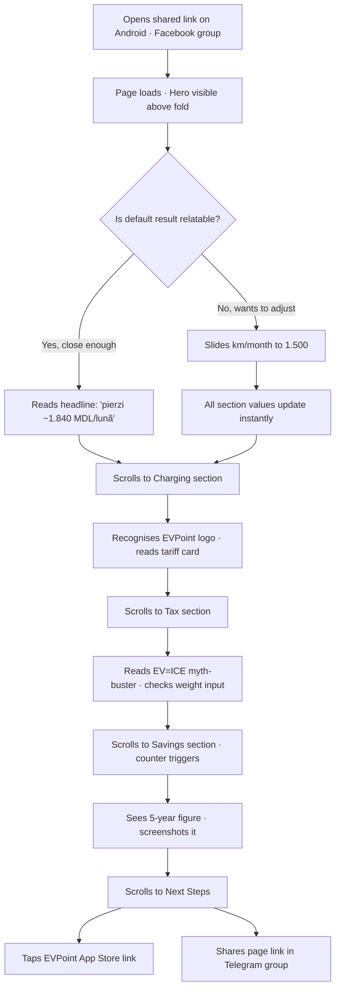
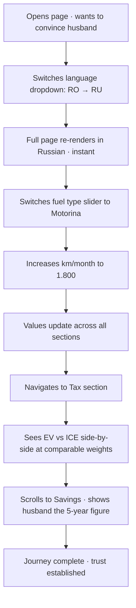
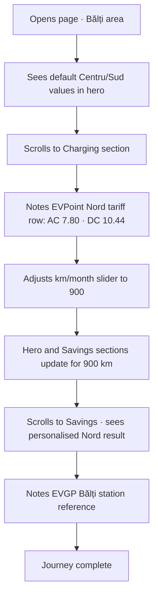
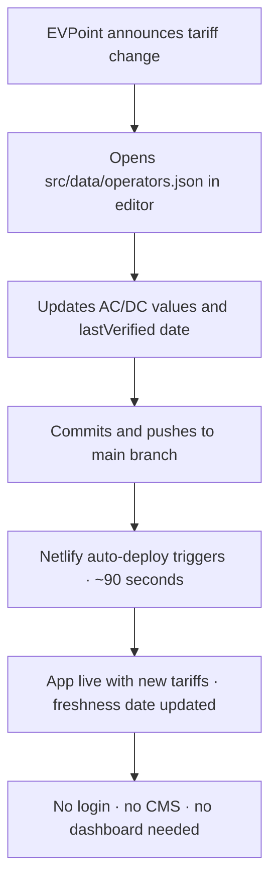

# UX Design Specification bmad-practice-project

**Author:** Dumitru.volosciuc
**Date:** 2026-04-30

---

## Executive Summary

### Project Vision

Moldova EV Overview is a single-page React application that gives Moldovan drivers a Moldova-specific, financially honest answer to one question: does switching to an EV actually make sense for me? The tool combines live ANRE fuel prices, real operator tariffs, the Moldova road tax table, and CO₂ impact into a single scroll — computed in MDL, updated automatically, requiring zero sign-up or backend infrastructure.

The core design philosophy is **honest urgency**: rather than promotional "here's what you'd save" messaging, the app uses loss-aversion language — "you're losing X MDL/month by not switching" — which reflects financial reality and resonates with a cost-conscious Moldovan audience.

### Target Users

| Persona                         | Context                                                                                       | Primary Need                                                            |
| ------------------------------- | --------------------------------------------------------------------------------------------- | ----------------------------------------------------------------------- |
| **Ion** — curious commuter      | Android mobile, sees a shared link on Facebook during lunch                                   | Understands his personal savings within 30 seconds, zero input required |
| **Natalia** — EV owner          | Wants to prove savings to a sceptical husband; needs Russian language and motorina comparison | Language switch + fuel type change + side-by-side tax comparison        |
| **Vasile** — Nord region driver | 900 km/month, Bălți area, aware of higher Nord tariffs                                        | Regional tariff visibility in EVPoint card                              |
| **Andrei** — maintainer         | Updates operator JSON on tariff changes, pushes to Netlify                                    | Not a UX user — his journey shapes data structure, not UI               |

Primary device: mid-range Android (360px+), 4G mobile connection. Secondary: desktop and iOS Safari.

### Key Design Challenges

1. **Trust vs. instant impact** — the tool must be both immediately convincing and deeply trustworthy, simultaneously. The loss-aversion headline must land before the user has touched a single input. Any hint of "marketing calculator" erodes trust.
2. **Slider complexity vs. simplicity** — four sliders, regional variation, fuel type selector, and vehicle weight input must feel completely effortless on a 360px screen operated by thumbs, without hiding capability.
3. **Data freshness transparency** — "Is this real?" is the unspoken first question from a Moldovan audience accustomed to outdated online information. Last-verified timestamps and live-fetch status must be visible without creating visual noise.

### Design Opportunities

1. **Loss-aversion framing as a primary UX pattern** — the headline saving figure should feel large, slightly uncomfortable, almost accusatory — before the user "resolves" it by scrolling to Next Steps. This emotional arc is unique among EV calculators globally.
2. **Operator cards as trust anchors** — real brand logos, real tariffs, and real App Store links transform this from a toy calculator into an authoritative Moldova EV directory.
3. **Language switch as an emotional unlock** — for Russian-speaking users, instant full-page re-render in Russian signals "this was made for me too," rare in Moldova's digital landscape and a strong driver of organic sharing.

## Core User Experience

### Defining Experience

The core user action is **passive comprehension followed by active validation**. The user arrives and receives a personalised-enough answer immediately (defaults cover the average Moldovan driver). They then adjust sliders to match their specific reality, watching numbers update live, until they trust the result enough to act.

The core loop: **see the number → understand why → adjust for your reality → act**.

### Platform Strategy

| Dimension             | Decision                                         |
| --------------------- | ------------------------------------------------ |
| Platform              | Web-only SPA — no native app                     |
| Primary input         | Touch (Android 360px+, mid-range)                |
| Secondary input       | Mouse/keyboard (desktop, iOS Safari)             |
| Offline               | Not required                                     |
| External capabilities | ANRE live fetch on mount (silent, with fallback) |
| Routing               | None — single HTML document, anchor scroll only  |

### Effortless Interactions

- **Slider recalculation** — zero latency, zero button press; numbers update as the thumb moves
- **Language switch** — full page re-render instantly; no partial state, no reload
- **Fuel price loading** — happens silently on mount; content is visible immediately, price updates in place when fetch completes; user never waits behind a spinner

### Critical Success Moments

| Time  | Moment                          | What must happen                                                        |
| ----- | ------------------------------- | ----------------------------------------------------------------------- |
| T+0s  | First paint                     | Loss-aversion headline visible above fold on mobile with default values |
| T+15s | Charging section                | User recognises EVPoint brand logo; trusts the tariff data              |
| T+45s | Savings section enters viewport | Animated counter triggers; 5-year figure stops the user                 |
| T+60s | Next Steps                      | User taps an App Store CTA or screenshots the 5-year figure             |

### Experience Principles

1. **Numbers first, explanation second** — the financial answer precedes any form or input
2. **Every interaction is live** — no buttons that "submit" or "calculate"; the app responds in real time
3. **Trust is earned through specificity** — brand logos, MDL amounts, last-verified dates, and real tariffs replace generic claims
4. **One scroll, one emotional arc** — the page is a story: cost → tax → loss → hope → action; no tabs, no routing, no rabbit holes

## Desired Emotional Response

### Primary Emotional Goals

**Primary: Uncomfortable Clarity**

The app should first make users feel something uncomfortable: _"I'm losing real money every month I delay this decision."_ That discomfort is intentional — it is the engine of the loss-aversion strategy. It must be followed immediately by **relief and agency**: _"Now I understand exactly what's happening, and I know what to do next."_

### Emotional Journey Mapping

| Stage             | Target Emotion         | What creates it                                                |
| ----------------- | ---------------------- | -------------------------------------------------------------- |
| First load (0–5s) | Mild shock / curiosity | Oversized headline loss figure, no preamble                    |
| Charging section  | Trust, recognition     | Real operator logos, real tariffs, last-verified dates         |
| Sliders           | Agency, control        | Immediate live recalculation — the user shapes their own truth |
| Tax section       | Surprise + relief      | EV=ICE road tax myth-busted — not what most users expect       |
| Savings section   | Visceral impact        | Animated counter rolling up; 5-year figure stops the user      |
| CO₂ section       | Warm pride             | Trees planted — soft, human, not preachy                       |
| Next Steps        | Confidence to act      | Direct, frictionless CTAs — no ambiguity about what to do      |

### Micro-Emotions

- **Trust over scepticism** — Real data, brand logos, source links, last-verified timestamps
- **Agency over helplessness** — Sliders respond instantly; user owns their result
- **Surprise over confirmation** — Tax myth-buster and 5-year figure are designed to exceed expectations
- **Urgency without anxiety** — Loss framing without alarm colours; teal keeps it forward-looking

### Design Implications

- Large, bold typography for the headline number → amplifies the initial shock
- Teal (not red) for accents → urgency without alarm
- Animated counter on scroll entry → transforms a static number into an event
- Operator logo images → emotional recognition, not just text
- "Last verified: [date]" inline with every data source → defuses scepticism before it forms
- Hardcoded fallback with visible date on ANRE fetch failure → user never sees an empty or broken state

### Emotional Design Principles

- **Emotions to engineer:** shock → trust → agency → surprise → impact → pride → confidence
- **Emotions to avoid:** overwhelm (too many numbers at once), distrust (marketing-speak, imprecise figures), helplessness (broken states with no fallback)

## UX Pattern Analysis & Inspiration

### Inspiring Products Analysis

**1. Wise (TransferWise) — Financial clarity SPA**
The answer appears before any form is filled. Live recalculation as you type. Trust built through specificity — exact fees, exact rates, not estimates. Clean dark aesthetic with a single dominant metric.
_Relevance:_ Direct model for "the number before the form" pattern and instant live feedback.

**2. Carbon footprint calculators (Atmosfair, myclimate)**
Emotional framing around a tangible metric (trees, flights, tonnes CO₂). Single-scroll flow. Section-by-section reveal of environmental impact.
_Relevance:_ CO₂ trees metaphor borrowed directly; their form-heavy, slow approach is the anti-model — we invert it with defaults-first.

**3. Solar ROI calculators (EnergySage)**
Sliders for personalisation, instant savings calculation, regional tariff data, payback-period framing.
_Anti-pattern identified:_ They require sign-up or location entry before showing any result — we deliberately never gate the answer behind user input.

**4. GOV.UK service pages — Information hierarchy**
Ruthless content hierarchy; zero decoration without meaning; progressive disclosure for complex detail via expandable sections.
_Relevance:_ Model for the "What is masa totală autorizată?" expandable explainer and overall heading hierarchy.

### Transferable Patterns

| Pattern                | Source            | Application                                           |
| ---------------------- | ----------------- | ----------------------------------------------------- |
| Answer before form     | Wise              | Loss-aversion headline visible on load with defaults  |
| Live recalculation     | Wise / EnergySage | Sliders update all dependent values with zero latency |
| CO₂ tree metaphor      | Atmosfair         | CO₂ section visual — trees planted per year           |
| Progressive disclosure | GOV.UK            | Expandable masa explainer; secondary operator detail  |
| Specificity as trust   | Wise              | Brand logos, MDL figures, last-verified dates         |

### Anti-Patterns to Avoid

- **"Calculate" buttons** — breaks the live feedback loop; creates friction before the result
- **Registration or location gates** — destroys trust for a public information tool
- **Percentage-only savings** — Moldova users need MDL, not abstract percentages
- **Generic EU data** — any figure not Moldova-specific immediately erodes credibility
- **Tabs or multi-page routing** — fragments the emotional arc; single scroll is the pattern

### Design Inspiration Strategy

**Adopt:** Wise's "answer-before-form" layout; GOV.UK's progressive disclosure for secondary detail; carbon calculator CO₂ metaphors.
**Adapt:** EnergySage's slider personalisation — simplified to 4 sliders with sensible Moldova defaults instead of requiring detailed input.
**Avoid:** Sign-up walls, percentage-only output, generic non-local data, multi-step flows.

## Design System Foundation

### Design System Choice

**Selected: Tailwind CSS with custom design tokens**

### Rationale for Selection

| Factor                              | Reasoning                                                                                               |
| ----------------------------------- | ------------------------------------------------------------------------------------------------------- |
| Dark/teal aesthetic already decided | Tailwind custom colour tokens (`teal-500`, `ev-accent`) trivial to configure                            |
| Minimal component needs             | Sliders, cards, stat boxes, animated counter — simpler custom-built than overriding a component library |
| Bundle performance                  | Zero unused CSS with Vite tree-shaking; supports <150KB bundle target                                   |
| Single-developer project            | No design-dev handoff friction; utility classes map directly to design decisions                        |
| WCAG AA accessibility               | Managed at component level via ARIA attributes; not delegated to a third-party library                  |

### Implementation Approach

- Tailwind config defines the full design token set once: colours, spacing, type scale, breakpoints
- All components consume tokens — no inline styles, no magic numbers
- Custom `tailwind.config.js` extends default theme with project-specific values
- No pre-built component library dependency — all UI components hand-crafted

### Customization Strategy

```
tailwind.config.js
  colors:
    ev-bg: #0f1117          (dark background)
    ev-surface: #1a1d27     (card/section background)
    ev-accent: #2dd4bf      (teal primary)
    ev-accent-hover: #14b8a6
    ev-text: #f8fafc        (primary text)
    ev-muted: #94a3b8       (secondary text)
    ev-warning: #f59e0b     (data freshness indicator)
  spacing: standard Tailwind scale
  typography: Inter (primary), system-ui fallback
  breakpoints: sm=360px, md=768px, lg=1024px
```

## Defining Core Experience

### Defining Experience

> _"See your Moldova-specific monthly loss — instantly, before touching anything — then make it yours by adjusting two sliders."_

The app's defining interaction is **passive personalisation**: the financial result is already there at first paint, personalised enough with defaults, and becomes exactly yours with minimal slider adjustment. This inverts the standard calculator UX (form → result) into (result → optional refinement).

### User Mental Model

Moldovan users arrive sceptical, carrying the mental model that "EV calculators are EU-centric, require lots of input, and give results that don't apply to me." The defining breakthrough is breaking that model at first paint — the result is already in MDL, already using local operator tariffs, already accounting for Moldova road tax. The user's first thought should be "this actually knows about Moldova" rather than "let me fill this form."

**Current workaround users have:** Manual lookup of ANRE prices + EVPoint tariffs + road tax estimation = 3–4 separate lookups and mental arithmetic. The app eliminates all of it.

### Success Criteria

- User understands their personal monthly loss within 30 seconds, zero input required
- Slider adjustment feels instantaneous — no perceived latency
- Numbers update across all sections simultaneously on any slider change
- User never encounters an empty or broken data state
- App Store CTA tap completes the journey without friction

### Novel UX Patterns

**Passive Personalisation** — Result precedes form. Defaults are calibrated to the average Moldovan driver so the first-paint answer is "close enough" for most users. Sliders refine rather than generate the result. No "Calculate" button exists.

**Loss-aversion as primary UX pattern** — The headline metric is a loss ("pierzi X MDL/lună"), not a gain. Unique among EV calculators globally. Amplified by oversized bold typography.

### Experience Mechanics

| Phase           | What happens                                                                                                                         |
| --------------- | ------------------------------------------------------------------------------------------------------------------------------------ |
| **Initiation**  | Automatic — loss figure present at T+0 with defaults; user is passive recipient first                                                |
| **Interaction** | km/month and fuel type sliders cover 80% of personalisation; weight + charging mode are secondary                                    |
| **Feedback**    | Real-time update across all dependent values; subtle value-highlight pulse confirms change; animated counter re-triggers on re-entry |
| **Completion**  | Felt, not clicked — when the 5-year figure resonates, user screenshots or taps App Store CTA                                         |

## Visual Design Foundation

### Color System

| Token             | Hex       | Role                                            |
| ----------------- | --------- | ----------------------------------------------- |
| `ev-bg`           | `#0f1117` | Page background — deep near-black               |
| `ev-surface`      | `#1a1d27` | Cards and section backgrounds                   |
| `ev-surface-2`    | `#252836` | Nested surfaces, hover states                   |
| `ev-accent`       | `#2dd4bf` | Teal primary — CTAs, highlights, active sliders |
| `ev-accent-hover` | `#14b8a6` | Teal hover/pressed state                        |
| `ev-text`         | `#f8fafc` | Primary text                                    |
| `ev-muted`        | `#94a3b8` | Secondary text, labels, timestamps              |
| `ev-warning`      | `#f59e0b` | Data freshness / ANRE fallback state indicator  |

Contrast ratios: `ev-text` on `ev-bg` = 17:1 (AAA). `ev-accent` on `ev-bg` = 7.2:1 (AA large text). All WCAG 2.1 AA compliant.

### Typography System

**Primary typeface:** Inter (geometric, neutral, excellent multilingual support for Romanian diacritics and Cyrillic)  
**Fallback stack:** system-ui, -apple-system, sans-serif

| Scale     | Size    | Weight | Use                                |
| --------- | ------- | ------ | ---------------------------------- |
| `display` | 56–72px | 800    | Loss-aversion headline loss figure |
| `h1`      | 36px    | 700    | Section titles                     |
| `h2`      | 24px    | 600    | Card headers                       |
| `body`    | 16px    | 400    | Body text                          |
| `label`   | 14px    | 500    | Slider labels, form labels         |
| `small`   | 13px    | 400    | Last-verified dates, helper text   |

### Spacing & Layout Foundation

- **Base unit:** 4px — all spacing is multiples of 4
- **Section padding:** 64px vertical (desktop), 40px (mobile)
- **Card padding:** 24px
- **Max content width:** 720px centered — single-column focus on all viewports
- **Grid:** single-column mobile; optional 2-column stat boxes on ≥768px
- **Touch targets:** minimum 44×44px for all interactive elements
- **Breakpoints:** sm=360px, md=768px, lg=1024px

### Accessibility Considerations

- WCAG 2.1 AA target — all contrast ratios verified
- Sliders use `<input type="range">` with `aria-label`, `aria-valuemin`, `aria-valuemax`, `aria-valuenow`
- Language switcher announces change via `aria-live="polite"` region
- Animated savings counter respects `prefers-reduced-motion` — shows final value immediately if reduced motion is preferred
- All interactive elements keyboard-navigable with visible focus indicators

## Design Direction Decision

### Design Directions Explored

Six directions were generated and evaluated as an interactive HTML showcase (`ux-design-directions.html`):

| #           | Name                                               | Character                             |
| ----------- | -------------------------------------------------- | ------------------------------------- |
| 1 · Signal  | Dark, single-column, teal accent, display headline | Closest to PRD vision                 |
| 2 · Ledger  | Data-table, two-column hero, blue accent           | Data-dense but breaks on mobile       |
| 3 · Ember   | Dark warm, amber/gold accent                       | Warm but wrong emotional association  |
| 4 · Minimal | Light mode, teal accent                            | Trustworthy but contradicts dark spec |
| 5 · Grid    | Magazine editorial, bold grid lines                | Authoritative but complex responsive  |
| 6 · Flow    | Gradient, card grid, app-store feel                | Striking but fragments emotional arc  |

### Chosen Direction

**Direction 1 — "Signal"**

Full-bleed dark background (`ev-bg: #0f1117`), single-column max-width 720px layout, oversized teal display headline, transparent-to-solid sticky header, section-by-section vertical scroll.

### Design Rationale

- **Only direction where the loss figure dominates above the fold on 360px mobile** with zero competing elements — core UX thesis preserved
- Single column collapses to mobile without any responsive breakpoint complexity
- Teal accent (`#2dd4bf`) on deep dark background creates maximum contrast and forward momentum without alarm-red associations
- Transparent → solid header on scroll is a trust signal that the page is a live document, not a static brochure
- Consistent with PRD "dark/teal design" specification

### Implementation Approach

- Sticky header: `position: sticky; top: 0; backdrop-filter: blur(12px)` — solid background applied via scroll listener adding a CSS class
- Section anchors: `id` attributes on each section `<div>`, header `<a href="#section-id">` links with `scroll-behavior: smooth` on `<html>`
- Max-width container: `max-width: 720px; margin: 0 auto; padding: 0 24px` on all section inner wrappers
- Stat boxes: CSS Grid `grid-template-columns: repeat(3, 1fr)` on ≥480px, single column below

## User Journey Flows

### Journey 1 — Ion, the Curious Commuter (Primary · Happy Path)



### Journey 2 — Natalia, the EV Owner (Language Switch · Comparison)



### Journey 3 — Vasile, the Nord Region Driver



### Journey 4 — Andrei, the Data Maintainer



### Journey Patterns

| Pattern                                                                             | Applies to           |
| ----------------------------------------------------------------------------------- | -------------------- |
| **Default-first reveal** — answer visible before any input                          | Ion, Vasile          |
| **Slider-triggered recalculation** — all dependent values update simultaneously     | Ion, Natalia, Vasile |
| **Language switch** — full re-render, no partial state                              | Natalia              |
| **Progressive disclosure** — masa explainer, ANRE fallback visible only when needed | All                  |
| **One-tap CTA exit** — App Store link ends the journey without friction             | Ion                  |

### Flow Optimisation Principles

- Every journey reaches a "shareable moment" (5-year figure, page link) — share intent is the primary success signal
- No journey requires an account, form submission, or page navigation
- Error states (ANRE fetch failure) degrade gracefully with a visible fallback date and never block content

## Component Strategy

### Design System Components

Tailwind CSS provides no pre-built UI components — all components are custom-built using design tokens from `tailwind.config.js`. This gives full control over every interaction, state, and accessibility attribute.

### Custom Components

| Component               | Priority | Purpose                                                       |
| ----------------------- | -------- | ------------------------------------------------------------- |
| `LossHeadline`          | P0       | Personalised monthly loss figure, above fold, live-updating   |
| `SliderInput`           | P0       | Labelled range input with live value display and hint text    |
| `OperatorCard`          | P0       | Charging operator tariff data with freshness date             |
| `StatBox` / `StatGrid`  | P0       | Monthly / Annual / 5-Year savings in 3-column grid            |
| `SavingsCounter`        | P0       | Animated count-up triggered by IntersectionObserver           |
| `StickyHeader`          | P0       | Anchor nav + language switcher; transparent → solid on scroll |
| `LanguageSwitcher`      | P0       | RO / EN / RU dropdown triggering full i18n re-render          |
| `TaxComparison`         | P1       | EV vs ICE road tax side-by-side                               |
| `AnreFreshnessBanner`   | P1       | Live vs fallback ANRE data status indicator                   |
| `ProgressiveDisclosure` | P1       | Expandable section for masa explainer and methodology         |
| `NextStepsCTA`          | P1       | App Store / Play Store deep links                             |
| `CO2Visual`             | P2       | Trees-planted-per-year visualisation (V1 optional)            |

**Component Specifications:**

**`LossHeadline`** — `aria-live="polite"` region; updates announced on slider change. Typography: display scale (56–72px, weight 800, `ev-accent`).

**`SliderInput`** — `<input type="range">` with `aria-label`, `aria-valuemin/max/now`, `aria-valuetext`. Track height 20px, thumb 28px (effective tap target 44px+).

**`OperatorCard`** — Two variants: `full` (EVPoint with regional tariff table + app links) and `placeholder` (operators with app-only tariffs). Always shows `lastVerified` date.

**`SavingsCounter`** — `IntersectionObserver` triggers on section entry; counts from 0 to final value over 1.2s. Respects `prefers-reduced-motion`: shows final value immediately.

**`StickyHeader`** — Scroll listener adds `.scrolled` class at >10px; CSS transition handles `background-color` and `backdrop-filter`. Mobile: compact anchor row at <768px.

**`LanguageSwitcher`** — Updates `localStorage['lang']`; triggers React context re-render. `role="combobox"`, `aria-live="polite"` on language change.

**`AnreFreshnessBanner`** — Two states: `live` (teal dot + timestamp) and `fallback` (amber dot + cached date). Never blocks content rendering.

**`ProgressiveDisclosure`** — Built on native `<details>` / `<summary>` for keyboard accessibility by default.

### Component Implementation Strategy

All components consume Tailwind design tokens exclusively — no inline styles, no magic numbers. Each component is a single React functional component with TypeScript props interface. State managed at the page level via React `useState`; components are stateless presentational except `SavingsCounter` (manages its own animation frame) and `StickyHeader` (manages its own scroll listener).

### Implementation Roadmap

| Phase                     | Components                               | Rationale                                           |
| ------------------------- | ---------------------------------------- | --------------------------------------------------- |
| 1 — Shell                 | `StickyHeader`, `LanguageSwitcher`       | Structural foundation; all sections depend on these |
| 2 — Core value            | `LossHeadline`, `SliderInput`            | Primary UX thesis; must work before anything else   |
| 3 — Trust anchors         | `OperatorCard`, `AnreFreshnessBanner`    | Credibility layer                                   |
| 4 — Education             | `TaxComparison`, `ProgressiveDisclosure` | Myth-buster section                                 |
| 5 — Impact                | `StatGrid`, `SavingsCounter`             | Emotional peak of the page                          |
| 6 — Action                | `NextStepsCTA`                           | Journey completion                                  |
| 7 — Delight (V1 optional) | `CO2Visual`                              | Drops without breaking the financial argument       |

## UX Consistency Patterns

### Button Hierarchy

| Tier        | Usage                                                | Visual                                           |
| ----------- | ---------------------------------------------------- | ------------------------------------------------ |
| Primary     | App Store CTAs, one main action per section max      | `ev-accent` background, `ev-bg` text, 8px radius |
| Ghost       | Secondary actions ("Află mai mult", operator detail) | Transparent, `ev-accent` border + text           |
| Inline text | Help links, source attribution                       | No border, `ev-muted` colour, underline on hover |

No "Calculate" button exists anywhere in the app — this is a deliberate anti-pattern for this product.

### Feedback Patterns

| State                   | Trigger                         | Visual                                                                     |
| ----------------------- | ------------------------------- | -------------------------------------------------------------------------- |
| Live ANRE data          | Fetch succeeded on mount        | Teal dot + "Prețuri ANRE actualizate: [HH:MM]"                             |
| Fallback ANRE data      | Fetch failed or timed out (>3s) | Amber dot + "Prețuri din cache: [dd mmm yyyy]" — never an error message    |
| Value updated           | Any slider moved                | 300ms highlight pulse on all dependent numeric values (`@keyframes` flash) |
| Savings section entered | `IntersectionObserver` fires    | `SavingsCounter` animation triggers once; does not re-trigger              |
| Disclosure expanded     | User opens masa explainer       | Smooth `max-height` CSS transition — no layout jump                        |

### Form / Input Patterns

- All inputs are sliders or segmented controls — no free-text entry, no validation errors, no required fields
- Fuel type: segmented button group (Benzina 95 / Motorina / GPL), not a `<select>`
- Vehicle weight: range slider 500–5000 kg, step 50 kg, with "Găsește masa pe talonul mașinii" helper text
- Every slider shows: label (left) + live value with unit (right) + hint text below
- No "Reset to defaults" in V1 — page refresh serves this purpose

### Navigation Patterns

- Single-page anchor scroll — no `pushState`, no back-button implications
- Active section highlighted in sticky header via `IntersectionObserver` on each `<section>`
- `scroll-behavior: smooth` on `<html>`; anchor links use 80px scroll offset to clear sticky header
- Header collapses to compact anchor row on <768px (no hamburger — all four anchors fit in one row)

### Data State Patterns

| Scenario             | Behaviour                                                                          |
| -------------------- | ---------------------------------------------------------------------------------- |
| Initial page load    | Content renders immediately with hardcoded defaults; ANRE fetch runs in background |
| ANRE fetch resolves  | Headline and fuel-cost values update in place with fade transition                 |
| ANRE fetch timeout   | Fallback activates silently; banner switches to amber state                        |
| Savings result ≈ 0   | Shows "Economii minime la acest profil" — never a negative number                  |
| Language key missing | Falls back to Romanian — never exposes raw i18n key strings                        |

### Typography Consistency

- Section labels: 11px, uppercase, letter-spacing 0.12em, `ev-accent` — identical across all sections
- Section titles: 28px, weight 700 — identical across all sections
- All MDL figures: `font-variant-numeric: tabular-nums` — prevents layout shift during live counter updates

## Responsive Design & Accessibility

### Responsive Strategy

**Mobile (360–767px) — primary design target:**

- Single column, full-width sections
- Header: logo + 4 compact anchor links in one row (no hamburger needed)
- Display headline: 48px (scales down from 68px desktop)
- Sliders: full-width, 44px effective thumb hit area
- Stat grid: 3-column on ≥480px, single column below 480px

**Tablet (768–1023px):**

- Same single-column layout — no structural change
- Section padding: 56px vertical
- Operator cards: optional 2-column grid if ≥2 cards visible

**Desktop (≥1024px):**

- Max-width 720px content column, centred — single column intentional
- Display headline: 68–72px
- Section padding: 64px vertical

### Breakpoint Strategy

```
default  → mobile 360px+    (base styles)
sm:      → 480px             (stat grid → 3-column)
md:      → 768px             (tablet padding adjustments)
lg:      → 1024px            (desktop, centred max-width container)
```

Mobile-first implementation: base styles target 360px; `md:` and `lg:` override upward.

### Accessibility Strategy

**Target: WCAG 2.1 AA**

| Area                | Requirement                               | Implementation                                                                       |
| ------------------- | ----------------------------------------- | ------------------------------------------------------------------------------------ |
| Colour contrast     | 4.5:1 normal text, 3:1 large text         | `ev-text` on `ev-bg` = 17:1 ✓; `ev-accent` on `ev-bg` = 7.2:1 ✓                      |
| Keyboard navigation | All interactive elements reachable by Tab | Sliders, header links, language switcher, disclosures, CTAs in natural DOM order     |
| Focus indicators    | Visible ring on all focusable elements    | `focus-visible:ring-2 focus-visible:ring-ev-accent` via Tailwind                     |
| Screen reader       | Meaningful labels on all controls         | `aria-label` on sliders; `aria-live="polite"` on hero headline and language switcher |
| Motion              | Animated counter respects preference      | `prefers-reduced-motion: reduce` → counter shows final value immediately             |
| Touch targets       | Min 44×44px                               | Slider thumb 28px visual / 44px effective via padding; CTA min-height 48px           |
| Language attribute  | `lang` updated on language switch         | `document.documentElement.lang` updated when user changes language                   |
| Skip link           | Skip to main content                      | Visually hidden `<a href="#main-content">` as first DOM element, visible on focus    |
| Semantic HTML       | Correct heading hierarchy                 | `h1` page title → `h2` section titles → `h3` card titles; no levels skipped          |

### Testing Checklist

- [ ] Keyboard-only navigation through entire page
- [ ] VoiceOver (iOS Safari) + NVDA (Windows Chrome) screen reader pass
- [ ] Chrome DevTools colour blindness simulation (deuteranopia, protanopia)
- [ ] Lighthouse accessibility audit ≥95
- [ ] `axe-core` zero critical violations
- [ ] Real device: mid-range Android (360px, Chrome), 4G throttled
